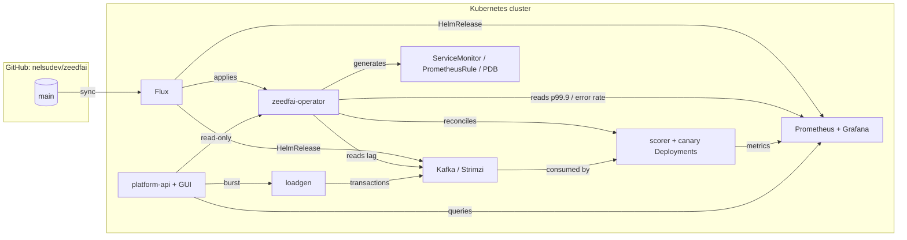

# 🕵️ zeedfai

> **A Kubernetes operator that runs fraud-scoring pipelines — and proves it
> can be trusted with them.**
> Consumer-lag autoscaling, SLO self-healing, canary rollback, all delivered
> and observed through GitOps. Everything below was run and verified live,
> not just written.

[](https://claude.ai)


-231F20?style=flat-square&logo=apachekafka&logoColor=white)

-7B42BC?style=flat-square&logo=terraform&logoColor=white)

## 🎯 Why this exists

- **A real platform-engineering domain, not a toy CRUD app.** Fraud scoring
  has a hard industry SLA — Feedzai's public research puts it at **p99.9 <
  250 ms** — so the project has a genuine constraint to design against
  instead of an arbitrary one.
- **Every claim below is backed by a live run, not a diagram.** Burst 3 000
  ev/s → lag climbs to ~6 350 → replicas scale 2→10 → drain → cooldown-paced
  scale-in back to 2. A 50%-fault canary image gets rolled back
  automatically in ~80 s. These numbers are from actual runs on this repo,
  not projections.
- **It runs entirely on one laptop.** kind + Strimzi + kube-prometheus-stack
  + k3d for node scaling — no cloud account required to see the whole thing
  work end to end. Cloud (Hetzner) is an optional, cost-conscious extra.
- **The bugs are on the record.** Commit history and `docs/FAQ.md` keep the
  real failures found while building this — a Prometheus selector that
  silently blinded the canary analysis, a Service missing labels the
  ServiceMonitor needed, a stray Go toolchain mismatch — because that's what
  actually differentiates hands-on platform work from a slide deck.

## 💡 The idea

An operator (`ScoringPipeline` CRD) reconciles a Kafka-consuming scorer
Deployment, then keeps it healthy on its own:

- 📈 **Autoscaling by consumer lag**, not CPU — the metric that actually
  predicts a fraud-scoring SLA breach.
- 🩹 **Self-healing on SLO violation** — p99.9 over budget forces an extra
  replica even before lag catches up.
- 🐤 **Canary with automatic rollback, never automatic promotion** — a bad
  candidate image gets pulled back by the operator within a couple of
  minutes; a *good* one only ever gets promoted by a human Git commit, so
  the operator can never fight Flux over the source of truth.
- 🔭 **Self-generated observability** — every pipeline gets its own
  `ServiceMonitor`, `PrometheusRule` (with a `runbook_url` on every alert),
  and `PodDisruptionBudget`, with zero manual wiring.
- 🖥️ **An operations GUI** (`platform-api/`) — read-only by design, live
  charts for lag/replicas/p99.9/throughput, and a 🔥 Burst button to drive
  the whole demo from a browser.



Full walkthrough of every file and every design decision (and why):
[`docs/ARCHITECTURE.md`](docs/ARCHITECTURE.md).

## 🚀 Quick start

Everything runs locally on **kind** (Kubernetes-in-Docker).

### Prerequisites

- **Linux + [Docker](https://docs.docker.com/engine/install/)** — the only
  hard requirement; 8 GB+ free RAM recommended (Kafka + Prometheus + Grafana
  + the operator add up).
- **`make`** and **`git`** — installed by default on most distros; if not:
  `sudo apt install make git` (Debian/Ubuntu) or `sudo dnf install make git`
  (Fedora).
- Everything else — **Go, kind, kubectl, Helm, Flux** — is installed for you
  into `~/.local` by the first command below, no sudo needed.

```bash
git clone https://github.com/nelsudev/zeedfai && cd zeedfai
make tools                                            # go, kind, kubectl, helm, flux → ~/.local
export PATH="$HOME/.local/bin:$HOME/.local/go/bin:$PATH"

make demo-up        # kind + Strimzi/Kafka + kube-prometheus-stack + loadgen + CRD (~5–8 min)
make run            # operator, dev loop (out-of-cluster)
make deploy-sample   # apply the example ScoringPipeline

kubectl get scoringpipelines -w   # Available=True once replicas are ready
make burst           # 2000 ev/s for 2 min — watch it autoscale
make demo-down       # tear down
```

**Full step-by-step guide with verified timings for all four demos**
(pipeline lifecycle, pod autoscaling, canary rollback, node autoscaling with
k3d): [`docs/LOCAL-DEMO-GUIDE.md`](docs/LOCAL-DEMO-GUIDE.md).
Hit a wall? [`docs/FAQ.md`](docs/FAQ.md) — real problems, real fixes.

## 🗂️ What's here

- 🧠 `operator/` — the controller (controller-runtime): CRD types,
  reconciler, autoscaler, canary analysis, self-generated observability.
- 🎯 `scorer/` — the Go service that consumes Kafka and scores transactions;
  exports Prometheus metrics.
- 🚿 `loadgen/` — synthetic transaction generator with a burst mode
  (`POST /burst`).
- 🖥️ `platform-api/` — read-only operations API + embedded GUI (charts +
  burst button, no external JS dependencies).
- ☸️ `gitops/` — the Flux repo structure (`clusters/` → `infrastructure/`),
  fully wired with `dependsOn` so CRDs, Kafka, monitoring, the operator, and
  the demo pipeline come up in the right order.
- 📖 `runbooks/` — one per alert, linked via `runbook_url`.
- 🩺 `docs/postmortems/` — a real, deliberately-induced Kafka broker outage,
  written up like an actual incident.
- ☁️ `terraform/hetzner/` — hourly-billed node-autoscaling target
  (`terraform validate`-clean, `apply` pending an account/token).
- 💸 `scripts/contabo/` — cheap fixed infra / API-automation demo, plus the
  nightly teardown Action that guards against forgotten cloud spend.

## 📚 Documentation map

| File | What it answers |
|---|---|
| [`docs/ARCHITECTURE.md`](docs/ARCHITECTURE.md) | What every component does and *why* — the reasoning, not just the code |
| [`docs/LOCAL-DEMO-GUIDE.md`](docs/LOCAL-DEMO-GUIDE.md) | Step-by-step for all four demos, with real verified timings |
| [`docs/FAQ.md`](docs/FAQ.md) | Things that actually break, and the fix |
| [`docs/postmortems/`](docs/postmortems) | A simulated incident, written up properly |

## 🧭 Roadmap

- [x] **Operator core** — reconciler, Deployment/Service, conditions
- [x] **Self-generated observability** — ServiceMonitor + PrometheusRule (with `runbook_url`) + PDB
- [x] **Full GitOps** — operator, Strimzi, Kafka, kube-prometheus-stack all Flux-managed
- [x] **Autoscaler + self-healing** — verified live: 3000 ev/s burst → 2→10→2 replicas
- [x] **Canary + automatic rollback** — verified live: 50%-fault image rolled back in ~80s
- [x] **Operations API + GUI** — read-only, live charts, burst button
- [~] **Cloud node autoscaling** — Terraform for Hetzner ready and validated; `apply` pending an account/token. Proven locally with k3d in the meantime (see the demo guide)

## 🤖 Made with Claude Fable

This project's design was worked out end-to-end with **[Fable](https://claude.ai)**,
Anthropic's Claude model 🪄 — starting from a job description, through the
architecture decisions (why lag over CPU, why rollback is automatic but
promotion isn't, why Hetzner over Contabo for node scaling), to the Go
implementation, the live verification runs, and the bug-hunting that
produced `docs/FAQ.md`. Built with Claude Code.
